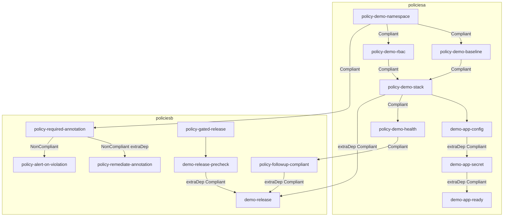

# ACM Policy Dependency Demo

PolicyGenerator demo for Red Hat Advanced Cluster Management (RHACM) policy dependencies. Ten policies are generated into two hub namespaces (`policiesa` and `policiesb`). Some wait for **Compliant**, some wait for **NonCompliant**, and several use **extraDependencies** on individual policy templates.

This follows the patterns in:

- [gatekeeper-examples policyGenerator.yaml](https://github.com/ch-stark/gatekeeper-examples/blob/main/policyGenerator.yaml)
- [Using Policy Dependencies to Apply Resources in a Specific Order](https://www.redhat.com/en/blog/using-policy-dependencies-to-apply-resources-in-a-specific-order)
- [RHACM 2.12 policy deployment](https://docs.redhat.com/en/documentation/red_hat_advanced_cluster_management_for_kubernetes/2.12/html/governance/policy-deployment)

Policy Generator cannot override `policyDefaults.namespace` per policy, so this repo uses **two PolicyGenerator files**.

## What you should see

On each managed cluster the policies create objects in namespace `dep-demo`. Unsatisfied dependencies show as **Pending** in Governance until the target compliance state is reached.

| Hub namespace | Policy | Activates when |
|---------------|--------|----------------|
| `policiesa` | `policy-demo-namespace` | Immediately |
| `policiesa` | `policy-demo-baseline` | `policy-demo-namespace` is **Compliant** |
| `policiesa` | `policy-demo-rbac` | `policy-demo-namespace` is **Compliant** |
| `policiesa` | `policy-demo-stack` | Baseline and RBAC are **Compliant**, then templates run in order via extraDependencies |
| `policiesa` | `policy-demo-health` | `policy-demo-stack` is **Compliant** |
| `policiesb` | `policy-required-annotation` | `policiesa/policy-demo-namespace` is **Compliant** |
| `policiesb` | `policy-remediate-annotation` | ConfigurationPolicy `demo-required-annotation` is **NonCompliant** |
| `policiesb` | `policy-followup-compliant` | `policiesa/policy-demo-health` is **Compliant** |
| `policiesb` | `policy-alert-on-violation` | `policy-required-annotation` is **NonCompliant** |
| `policiesb` | `policy-gated-release` | extraDependencies: local precheck **Compliant**, `policiesa/policy-demo-stack` **Compliant**, and `policy-followup-compliant` **Compliant** |



## Dependency kinds used

**`spec.dependencies`** gates the whole Policy. **`extraDependencies`** gates one ConfigurationPolicy template.

| Pattern | Where |
|---------|--------|
| Policy `dependencies` + `Compliant` | baseline, rbac, stack, health, required-annotation, followup |
| Policy `dependencies` + `NonCompliant` | `policy-alert-on-violation` |
| Template `extraDependencies` + `Compliant` | `policy-demo-stack`, `policy-gated-release` |
| Template `extraDependencies` + `NonCompliant` | `policy-remediate-annotation` |
| Cross-namespace Policy dependency | policiesb → policiesa (`namespace: policiesa`) |
| Multiple extraDependencies on one template | `demo-release` waits on three objects |
| `ignorePending: true` | remediator and alert, so Pending is treated as Compliant when there is nothing to do |

`policy-remediate-annotation` matches the certificate-refresh example in the RHACM blog: the enforce template stays Pending while the check is Compliant, `ignorePending: true` keeps the Policy Compliant, and `pruneObjectBehavior: DeleteAll` drops the remediating object when the template becomes inactive.

Leave `namespace` empty on ConfigurationPolicy extraDependencies. Those objects live in the managed cluster namespace. Set `namespace` on Policy dependencies (`policiesa` or `policiesb`).

## Apply on the hub

Policy Generator must be available (RHACM GitOps / OpenShift GitOps with the plugin, or `kustomize` with the [policy-generator-plugin](https://github.com/open-cluster-management-io/policy-generator-plugin)).

```bash
# 1. Hub namespaces and ManagedClusterSetBindings (required for Placement)
kubectl apply -k setup/

# 2. Generate and apply policies
kubectl apply -k policiesa/
kubectl apply -k policiesb/

# Optional: OpenShift GitOps Applications instead of step 2
# kubectl apply -f setup/03_applications.yaml
```

To preview generated Policies without applying:

```bash
kustomize build --enable-alpha-plugins --enable-exec policiesa/
kustomize build --enable-alpha-plugins --enable-exec policiesb/
```

Install the [Policy Generator plugin](https://github.com/open-cluster-management-io/policy-generator-plugin) under `~/.config/kustomize/plugin/policy.open-cluster-management.io/v1/policygenerator/PolicyGenerator` (or set `KUSTOMIZE_PLUGIN_HOME`). OpenShift GitOps on an RHACM hub already includes the plugin.

## Placement

Each generator creates a Placement that matches all clusters in the bound cluster set (`global`). Restrict it by editing `policyDefaults.placement` / `policySets[].placement` in the PolicyGenerator files, for example:

```yaml
placement:
  name: placement-policiesa
  labelSelector:
    matchExpressions:
      - key: local-cluster
        operator: In
        values:
          - "true"
```

## Layout

```
setup/                 # hub Namespaces, ManagedClusterSetBindings, optional Argo CD Applications
policiesa/             # PolicyGenerator → 5 Policies in namespace policiesa
  policyGenerator.yaml
  input/
policiesb/             # PolicyGenerator → 5 Policies in namespace policiesb
  policyGenerator.yaml
  input/
```
