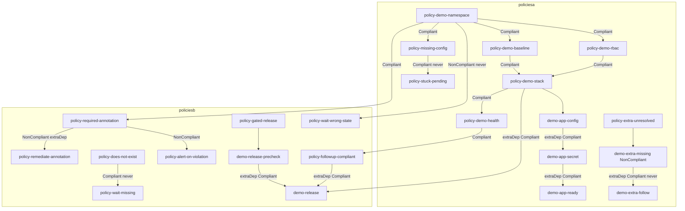
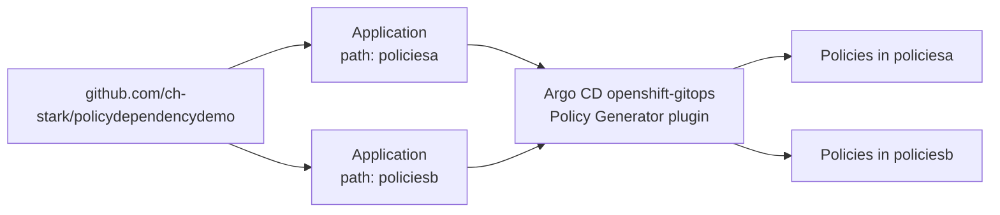

# ACM Policy Dependency Demo

PolicyGenerator demo for Red Hat Advanced Cluster Management (RHACM) policy dependencies. Policies are generated into two hub namespaces (`policiesa` and `policiesb`). Some wait for **Compliant**, some for **NonCompliant**, and several use **extraDependencies**. A second PolicySet in each namespace stays **NonCompliant** or **Pending** on purpose so unresolved dependencies are visible.

This follows the patterns in:

- [gatekeeper-examples policyGenerator.yaml](https://github.com/ch-stark/gatekeeper-examples/blob/main/policyGenerator.yaml)
- [Using Policy Dependencies to Apply Resources in a Specific Order](https://www.redhat.com/en/blog/using-policy-dependencies-to-apply-resources-in-a-specific-order)
- [RHACM 2.17 policy deployment](https://docs.redhat.com/en/documentation/red_hat_advanced_cluster_management_for_kubernetes/2.17/html/governance/policy-deployment)

Policy Generator cannot override `policyDefaults.namespace` per policy, so this repo uses **two PolicyGenerator files**.

## What you should see

On each managed cluster the happy-path policies create objects in namespace `dep-demo`. Unsatisfied dependencies show as **Pending**. The `*-unresolved` PolicySets stay NonCompliant or Pending.

| Hub namespace | Policy | Expected | Activates when |
|---------------|--------|----------|----------------|
| `policiesa` | `policy-demo-namespace` | Compliant | Immediately |
| `policiesa` | `policy-demo-baseline` | Compliant | `policy-demo-namespace` is **Compliant** |
| `policiesa` | `policy-demo-rbac` | Compliant | `policy-demo-namespace` is **Compliant** |
| `policiesa` | `policy-demo-stack` | Compliant | Baseline and RBAC are **Compliant**, then templates run in order via extraDependencies |
| `policiesa` | `policy-demo-health` | Compliant | `policy-demo-stack` is **Compliant** |
| `policiesa` | `policy-missing-config` | **NonCompliant** | Namespace exists, then informs for ConfigMap `demo-never-created` which is never created |
| `policiesa` | `policy-stuck-pending` | **Pending** | Waits for `policy-missing-config` **Compliant** (never happens) |
| `policiesa` | `policy-extra-unresolved` | **Pending** | extraDependencies wait for `demo-extra-missing` **Compliant** (that template stays NonCompliant) |
| `policiesb` | `policy-required-annotation` | Compliant after remediator | `policiesa/policy-demo-namespace` is **Compliant** |
| `policiesb` | `policy-remediate-annotation` | Compliant (`ignorePending`) | ConfigurationPolicy `demo-required-annotation` is **NonCompliant** |
| `policiesb` | `policy-followup-compliant` | Compliant | `policiesa/policy-demo-health` is **Compliant** |
| `policiesb` | `policy-alert-on-violation` | Compliant (`ignorePending`) | `policy-required-annotation` is **NonCompliant** |
| `policiesb` | `policy-gated-release` | Compliant | extraDependencies: local precheck **Compliant**, `policiesa/policy-demo-stack` **Compliant**, and `policy-followup-compliant` **Compliant** |
| `policiesb` | `policy-wait-missing` | **Pending** | Waits for `policiesa/policy-does-not-exist` **Compliant** (object never exists) |
| `policiesb` | `policy-wait-wrong-state` | **Pending** | Waits for `policiesa/policy-demo-namespace` **NonCompliant** (that policy is Compliant) |



## Dependency kinds used

**`spec.dependencies`** gates the whole Policy. **`extraDependencies`** gates one ConfigurationPolicy template.

| Pattern | Where |
|---------|--------|
| Policy `dependencies` + `Compliant` | baseline, rbac, stack, health, required-annotation, followup, missing-config, stuck-pending, wait-missing |
| Policy `dependencies` + `NonCompliant` | `policy-alert-on-violation`, `policy-wait-wrong-state` |
| Template `extraDependencies` + `Compliant` | `policy-demo-stack`, `policy-gated-release`, `policy-extra-unresolved` |
| Template `extraDependencies` + `NonCompliant` | `policy-remediate-annotation` |
| Cross-namespace Policy dependency | policiesb → policiesa (`namespace: policiesa`) |
| Multiple extraDependencies on one template | `demo-release` waits on three objects |
| `ignorePending: true` | remediator and alert, so Pending is treated as Compliant when there is nothing to do |
| Unresolved on purpose | `policy-missing-config` NonCompliant; `policy-stuck-pending`, `policy-extra-unresolved`, `policy-wait-missing`, `policy-wait-wrong-state` Pending |

`policy-remediate-annotation` matches the certificate-refresh example in the RHACM blog: the enforce template stays Pending while the check is Compliant, and `ignorePending: true` keeps the Policy Compliant when there is nothing to remediate. `pruneObjectBehavior` is `None` on that policy so it does not delete `dep-demo`. The alert notice uses `DeleteAll` so it is removed when the violation is gone.

Leave `namespace` empty on ConfigurationPolicy extraDependencies. Those objects live in the managed cluster namespace. Set `namespace` on Policy dependencies (`policiesa` or `policiesb`).

## Apply with OpenShift GitOps

You do **not** need two Argo CD instances. `policiesa` and `policiesb` are hub namespaces for the generated Policies. One cluster-scoped OpenShift GitOps instance (`openshift-gitops` in `openshift-gitops`) runs the Policy Generator plugin. Two **Applications** (not two Argo CD CRs) each read one path from this git repo.

That matches [policy-openshift-gitops-policygenerator.yaml](https://github.com/open-cluster-management-io/policy-collection/blob/main/community/CM-Configuration-Management/policy-openshift-gitops-policygenerator.yaml): patch the default `openshift-gitops` Argo CD CR, grant it Policy RBAC, then let Applications generate Policies.



```bash
# 1. Hub namespaces, ManagedClusterSetBindings, and GitOps bootstrap Policies
#    (operator Subscription + Policy Generator on the default Argo CD instance).
#    Those Policies are bound only to local-cluster.
kubectl apply -k setup/

# 2. Wait until both GitOps Policies are Compliant on local-cluster
kubectl get policy -n open-cluster-management-global-set
# Expected: openshift-gitops-operator, openshift-gitops-policygen
oc -n openshift-gitops get pods -l app.kubernetes.io/name=openshift-gitops-repo-server

# 3. Applications that generate Policies from this git repo
kubectl apply -k setup/applications/
```

`setup/gitops/policy-openshift-gitops-policygenerator.yaml` waits for `openshift-gitops-operator` to be **Compliant**, then enforces:

- Policy Generator init container on `ArgoCD/openshift-gitops` (binary from the hub `acm-cli-downloads` image)
- `kustomizeBuildOptions: --enable-alpha-plugins`
- ClusterRole/Binding so the `openshift-gitops-argocd-application-controller` service account can create Policies, PolicySets, Placements, and PlacementBindings

After sync, Governance should show the happy-path PolicySets as Compliant and `policiesa-unresolved` / `policiesb-unresolved` as NonCompliant or Pending.

To preview generated Policies without GitOps:

```bash
kustomize build --enable-alpha-plugins --enable-exec policiesa/
kustomize build --enable-alpha-plugins --enable-exec policiesb/
```

Install the [Policy Generator plugin](https://github.com/open-cluster-management-io/policy-generator-plugin) under `~/.config/kustomize/plugin/policy.open-cluster-management.io/v1/policygenerator/PolicyGenerator` (or set `KUSTOMIZE_PLUGIN_HOME`) if you apply with `kubectl -k` instead of Argo CD.

## Placement

Each generator creates a Placement that matches all clusters in the bound cluster set (`global`). Restrict it by editing `policyDefaults.placement` / `policySets[].placement` in the PolicyGenerator files, for example:

```yaml
placement:
  name: placement-policiesa
  labelSelector:
    matchExpressions:
      - key: local-cluster
        operator: In
        values:
          - "true"
```

## Layout

```
setup/
  01_namespaces.yaml              # policiesa, policiesb
  02_managedclustersetbinding.yaml
  gitops/                         # ACM Policies that configure OpenShift GitOps on local-cluster
  applications/                   # Argo CD AppProject + 2 Applications
policiesa/                        # PolicyGenerator → 5 Policies in namespace policiesa
policiesb/                        # PolicyGenerator → 5 Policies in namespace policiesb
```
